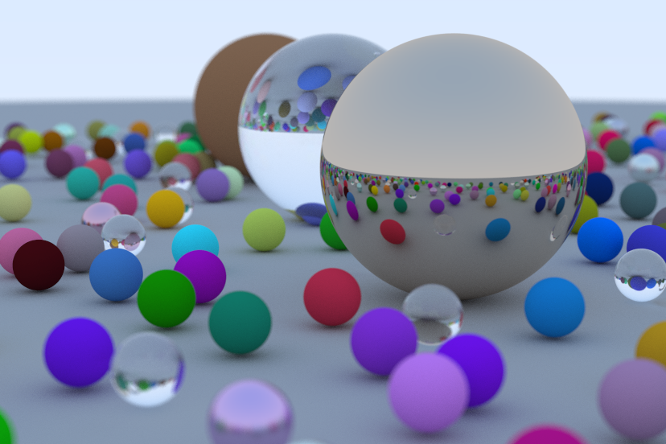

# Ray Tracing in One Weekend #

> [Ray Tracing in One Weekend](https://raytracing.github.io/v3/books/RayTracingInOneWeekend.html) in [TypeScript](https://www.typescriptlang.org/), [AssemblyScript](https://www.assemblyscript.org/) and [WebGL](https://registry.khronos.org/webgl/specs/latest/2.0/). 
[WebGPU](https://www.w3.org/TR/webgpu/) version is coming soon...

## Download ##

`git clone https://github.com/UstymUkhman/ray-tracing.git`

`cd ray-tracing`

## Develop ##

`pnpm i`

`pnpm start`

## Lint ##

`pnpm lint:js`

`pnpm lint:css`

## Build ##

`pnpm asbuild`

`pnpm build`

`pnpm serve`
